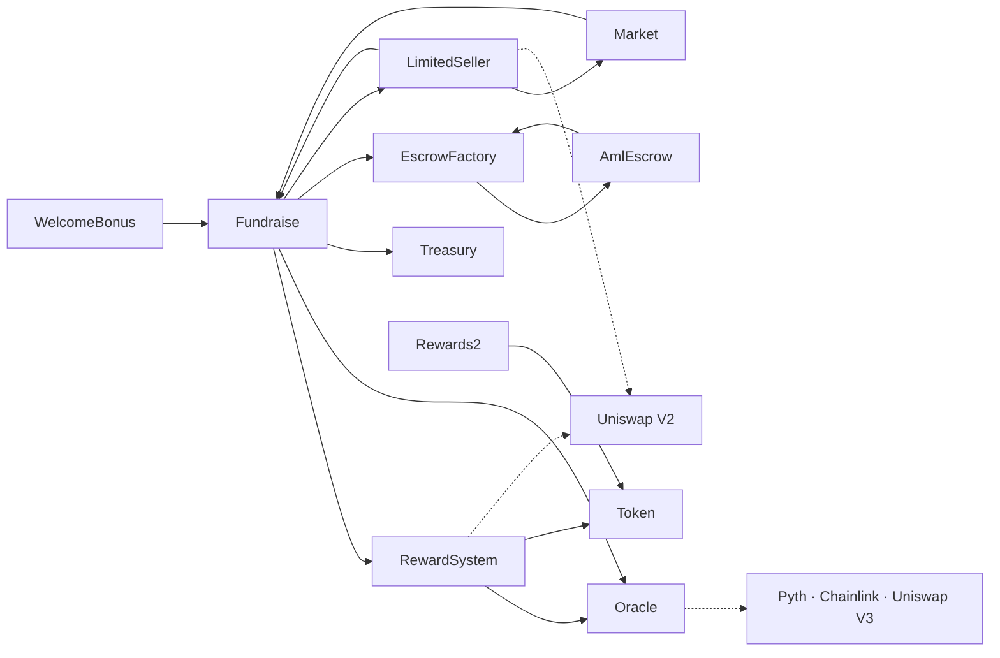
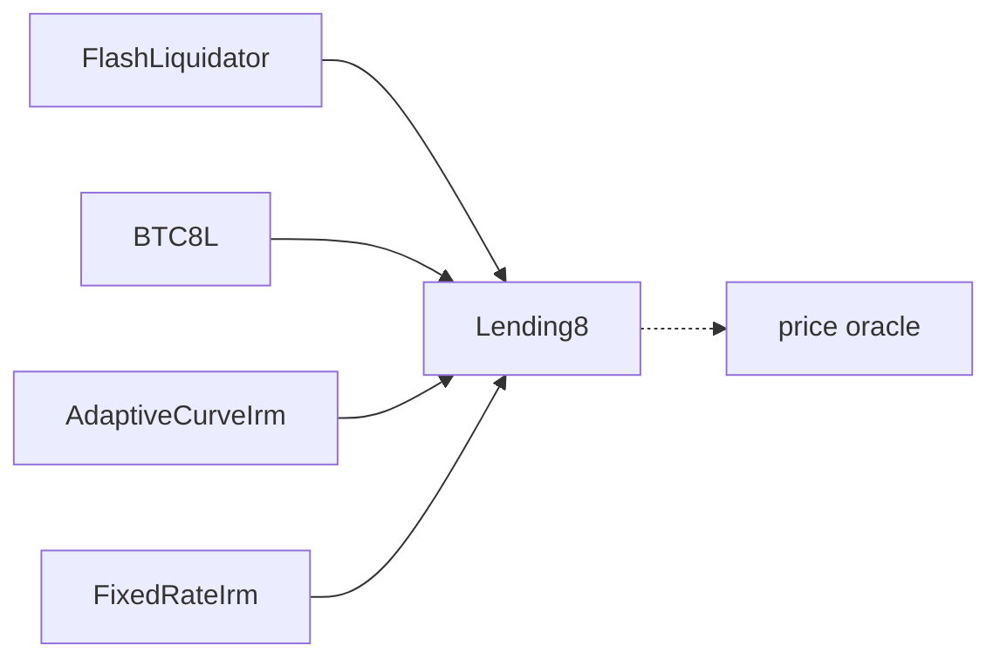

# Contracts

Map of this tree. For how to build, test and deploy, see the [root README](../README.md).

| Folder | Holds | Files |
|---|---|---|
| `core/` | The protocol: fundraising, rewards, access control, secondary market | 8 |
| `bonus/` | Five independent one-off campaigns, one file each | 5 |
| `token/` | `Token` (8LNDS) and `BTC8L` | 2 |
| `escrow/` | Per-user escrow for AML-gated investments, and its factory | 2 |
| `oracle/` | Price feed with source priority and deviation checks | 3 |
| `lending/` | Lending market — a vendored Morpho fork, see below | 29 |
| `interfaces/` | All shared interfaces, grouped by origin | 26 |
| `mocks/` | Test doubles. Never deployed | 14 |
| `test-tokens/` | USDC/WBTC/WETH stand-ins, deployed on Sepolia only | 4 |

Folders exist per contract only where they earn it: `core/market/` because `Market.md`
sits beside the contract, `token/8lnds/` because the folder name is what says which token
`Token.sol` is. Everything else is flat.

## How they fit together

Fundraising and rewards. Arrows point from caller to callee:

`Fundraise` is the hub: it records investments, asks `Oracle` for the platform-token price,
tells `RewardSystem` what to accrue, sends the platform fee to `Treasury`, and routes
AML-gated investments through an escrow. `Market` and `LimitedSeller` call back into it to move
positions and to read how much a user invested.

Lending is a separate subsystem, reached by address rather than by import:

`ManagerRegistry` is left out of both diagrams on purpose: ten contracts consult it — five in
`core` (`Fundraise`, `RewardSystem`, `Rewards2`, `LimitedSeller`, `Market`), four of the five
bonus campaigns, and `Token` — and drawing that would bury everything else. Nothing calls out of
it; it only answers "is this address a manager, an operator, a pool".

## Deployment model

Eighteen contracts are UUPS-upgradeable behind an ERC-1967 proxy. On production the owner is
a Gnosis Safe, so upgrades go through a prepared batch rather than a direct call.

Four are not upgradeable, each for its own reason:

- `Token` — a plain `ERC20, Ownable`. Deliberate: the platform token's rules are fixed.
- `AdaptiveCurveIrm`, `FixedRateIrm` — interest rate models, deployed plain and swapped by
  enabling a new address on the market. Each keeps per-market rate state, so a swap starts that
  state from scratch rather than carrying it over.
- `AmlEscrow` — deployed as an EIP-1167 minimal clone by `EscrowFactory`, one per user, with
  `initialize()` instead of a constructor. Addresses are `CREATE2`-deterministic and depend on
  the implementation address, not on where its source lives.

`TreasuryLending` is `contract TreasuryLending is Treasury {}` — an empty subclass, deployed
separately so lending fees sit in their own contract with their own owner.

## Interfaces

Split by who controls the shape:

- `protocol/` — our contracts. These must stay in step with the deployed ABI; a signature that
  drifts here compiles fine and reverts on chain.
- `external/` — third-party ABIs (Uniswap, Chainlink, Pyth). Not ours to change.
- `token/` — ERC-20 and its extensions.

One interface per contract, holding everything its consumers need. Earlier each consumer kept
its own narrow copy; `IManagerRegistry` alone existed in ten copies across four versions, one
of which declared a function `ManagerRegistry` does not have. Unused declarations cost nothing
— an `interface` emits no code, only the selectors actually called end up in the bytecode.

`lending/` and `mocks/` keep their own copies on purpose: the first to stay syncable with
upstream, the second because it is test-only.

## lending/

A fork of Morpho Blue, vendored rather than imported. Treat it as upstream code: it is worth
keeping diffable against Morpho, so resist reformatting, renaming or moving files around inside
it. Its interfaces and libraries stay local for the same reason.

`FlashLiquidator` is ours, built on top of it: liquidation funded by a Lending8 flash loan when
a Uniswap pair exists, from the contract's own balance otherwise, falling back to direct
liquidation if the swap fails so an empty pair cannot block liquidations.
